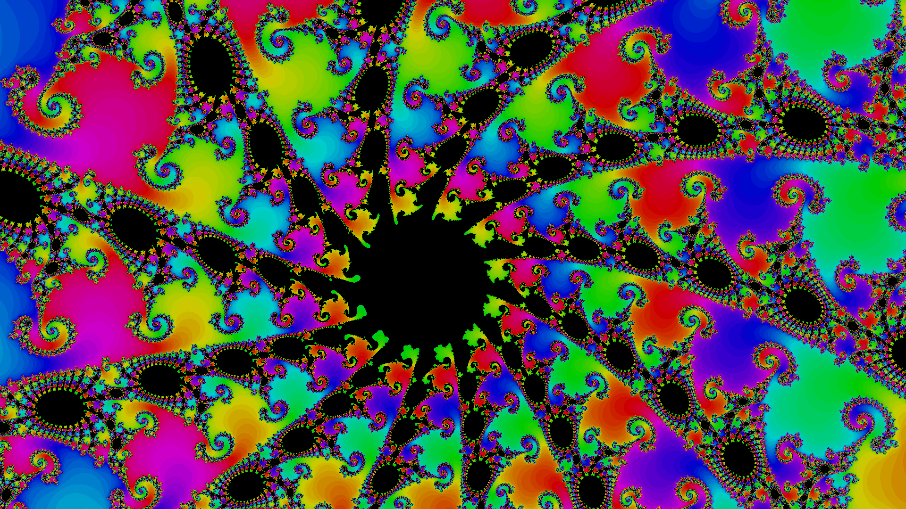

<p align="center">
  
</p>

<p align="center">
  
  
  
  
  

</p>

<p align="center">💠 Terminal based fractal explorer, including Mandelbrot, Burning Ship, and Julia. 💠</p>

# Fractalistic

<p align="center">
  
</p>

# How to install 📥

Clone the repo

```bash
git clone https://github.com/SkwalExe/fractalistic
cd fractalistic
```

Install the dependencies

```bash
pip install -r requirements.txt
```

Run the program

```bash
python3 -m fractalistic
```


# Features 🌟

**Available fractals**:
- Mandelbrot set
- Burning Ship set
- Every Julia sets

---

- 🖥️ Terminal based
- ✨ Next-gen Terminal UI with texutal
- 🔍 Zoom in/out
- 🚶 Move around
- ⚙️ Change max iterations
- 🎨 Change color palette
- 🔢 Custom decimal precision
- 📸 High definition screenshots


# Roadmap

Possible features to add later:
- [ ] Create a PyPI package
- [ ] Key to increase/decrease max iterations
- [ ] Use center as screen pos instead of top left corner
- [ ] Show zoom level in the title bar
- [ ] Allow use of builtin floats instead of gmpy2 for faster rendering 
- [ ] Splash screen
- [ ] Custom mandelbrot/burning ship starting value or exponent

Commands:
- [ ] Command to increase/decrease zoom speed
- [ ] Command to increase/decrease move speed
- [ ] Command to increase/decrease max iter
- [ ] Command to show current pos, zoom, etc
- [ ] Command to set decimal precision
- [ ] Command to screenshot (with size as args optionnaly)
- [ ] Command to save position to file
- [ ] Precise help command to explain args (ex: `help cmd_name`)
- [ ] Command to load position from a file

Command line options :
- [ ] Load fractal, position, and zoom from a file

# Development 

Please, open an issue if you have any suggestion or if you found a bug. I will try to fix it as soon as possible. If you want to contribute, open an empty pull request and explain what you want to do, wait for me to approve it and then you can start working on it.

# Screenshots


