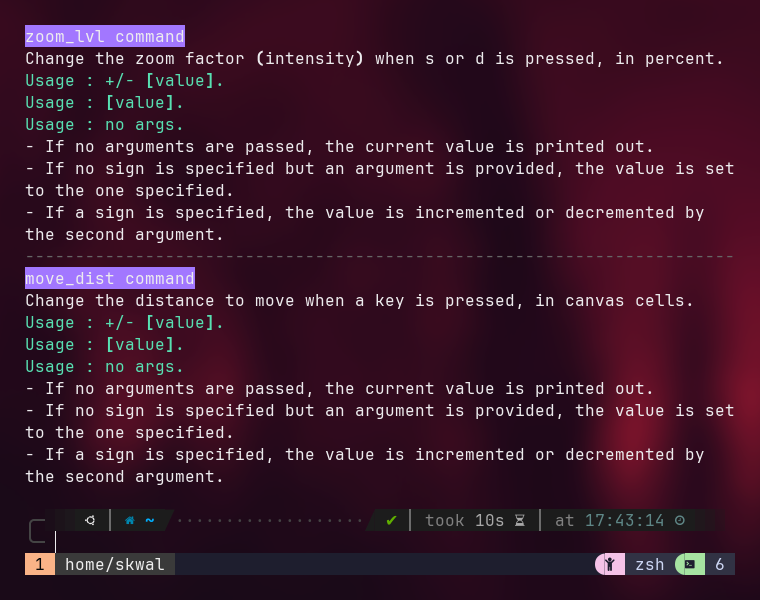

# Navigation 🧭

Navigating within the canvas is a fundamental part of this application. 
Understanding how to move around efficiently will enhance your experience and allow you to explore fractals deeper, and easier.

I tried to make navigation functions as intuitive and efficient as possible.
This section will cover basic controls, and navigation parameters.

### Basic controls 🎮 {#basic-controls}

To move your position inside the canvas, you can use to **arrow keys** to go left, right, up or down.
If you are a vim supremacist, you can use the **vim keys (`hjkl`).**
To zoom in or out, you can respectivly use `d` and `s`.

You can also zoom in or out on a specific position by **left-clicking or right-clicking on the canvas with your mouse.**

### Navigation parameters

Finally, you can change the zoom and movement intensity using the `zoom_lvl` and `move_dist` commands.

