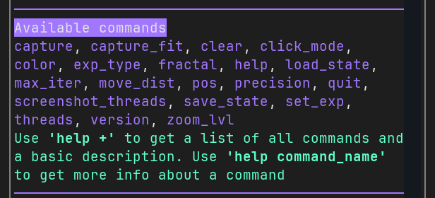

# General Presentation 💎 {#general-presentation}

Fractalistic aims to be as intuitive and easy to use as possible. Despite its complexity, navigating the interface is very straightforward. This section will guide you through the basic functions to help you get started quickly.
 

### The components 🪟 {#the-components}

Fractalistic provides **3 components** that you can interact with after opening the application.
- 🖼️ The canvas 
- 📜 the logs panel
- ⌨️  and the command input. 

You must focus a component to interact with it. By default, **the canvas is active** (as indicated by the blue border), but you can select the logs panel or the command input either with **a mouse click**, or by **pressing tab.**

### The canvas 🖼️ {#the-canvas}

When focused, the canvas listens for keypresses that will trigger an action. For example, using the arrow keys will allow you to navigate within the current fractal. The canvas usage and basic navigation will be covered in a future section.

### The logs panel 📜 {#the-logs-panel}

The logs panel is where the commands output will be displayed. You can use the mouse, the scroll bar, or the keyboard keys to scroll through the logs.

### The command input ⌨️  {#the-command-input}

The command input feature enables you to interact with the application, allowing for **more complex actions** beyond basic navigation. 

Details on how to use the command system will be provided in a later section. If you are curious, you can run the `help` or `help +` commands to get an overview of the available commands!

