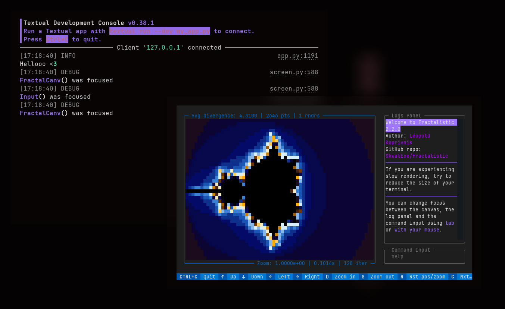

# Project setup 🏗️ {#projec-setup}

Before you start programming, you must setup the project locally.

First, you will need to [**fork**](https://docs.github.com/en/pull-requests/collaborating-with-pull-requests/working-with-forks/fork-a-repo) the [Github repository](https://github.com/SkwalExe/fractalistic), and clone it.

```bash
# Replace SkwalExe with your github username
git clone https://github.com/SkwalExe/fractalistic
cd fractalistic
```

> [PDM](https://pdm-project.org/en/latest/) is used as a package manager for the project. \
> If you need to install it, you can do so as follows on Linux systems:
>
>    ```bash
>    curl -sSL https://pdm-project.org/install-pdm.py | python3 -
>    ```

Then, install the project and the dependencies.

```bash
pdm install
```

You can now start to make changes!

### Running the app

Since Fractalistic uses a TUI (GUI-like interface but in the terminal) you cannot use `print()` statements.

You will need to open 2 separate terminals. 
In the first one run `pdm console`, and in the second one, run `pdm run dev`. 

This will open the app in **dev mode**, allowing you to log messages 
to the **Textual console** (first terminal). To log messages within the code, 
you must use the `textual.log()` function, and import it if needed. (`from textual import log`)


