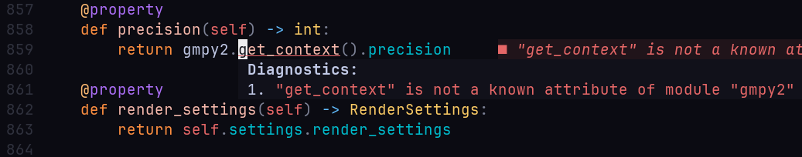

# Recommended IDE Setup ✅ {#recommended-setup}

Writing code is good, but writing code with the assistance of autocomplete, 
autoformatting, error notifications, and linting is even better. ✨

You are not required to use the tools mentioned below in your IDE. 
However, keep in mind that once you finish your changes, 
**your code must still conform to the project's quality standards.**

::: tip No worries 💫
You will be able to detect and correct errors automatically with the help of predefined PDM scripts, 
even if you don't use any of the IDE integrations presented below.

This will be covered in a later section.
:::

### Linting and formatting 🦀 {#linting-and-formatting}

We use [Ruff](https://docs.astral.sh/ruff/) for linting and formatting within our codebase.
It is recommended that you install an extension for this tool, to benefit from automatic linting and formatting.

- [Github repo for Ruff](https://github.com/astral-sh/ruff)
- [LSP for Ruff (Neovim, Sublime Text...)](https://github.com/astral-sh/ruff-lsp)
- [VSCode integration for Ruff](https://marketplace.visualstudio.com/items?itemName=charliermarsh.ruff)

### Type checking 👮 {#type-checking}

[Pyright](https://github.com/microsoft/pyright) is used for static type checking,
enabling us to detect errors during coding instead of at runtime. 
It can also identify rare errors that would otherwise be time-consuming to diagnose. 
Installing an IDE extension for Pyright is recommended to receive notifications whenever an error is detected.

- [Github repo for Pyright](https://github.com/microsoft/pyright)
- [For Neovim, you can use nvim-lspconfig](https://github.com/neovim/nvim-lspconfig)
- [VSCode integration for Pyright](https://marketplace.visualstudio.com/items?itemName=ms-pyright.pyright)
