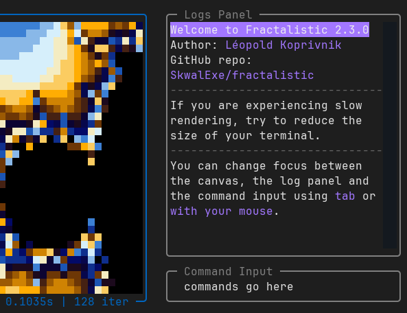
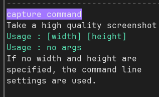

# The Command System 🛠️ {#the-command-system}

The command system is a central feature of Fractalistic.
It allows you to interact with the **underlying fractal rendering engine** to modify its behavior and execute complex tasks.
Experimenting with the rendering parameters is an excellent way to satisfy your curiosity, and deepen your understanding of fractals.
Adjusting the rendering engine can also allow you to **explore fractals in much grater depth** than possible with the default settings, as we will see in a later section. 

### How it works ❓ {#how-it-works}

The logs panel and the command input are used to interact with the command system. You enter your commands in the input field then press enter to execute them. Any output will appear in the logs panel.

### Available commands

You can list the available commands using `help`. If you want a brief description of each command, use `help +`.

::: info Command arguments
In this context, the `+` following `help` is an argument. Arguments are text segments added after the command name, separated by spaces.
They provide more information to a command, altering its behavior.
:::

You can use `help [command_name]` to obtain more information about a command, such as the arguments it accepts.

> 
>
> In the above screenshot, we can see the output of the `help capture` command.
> We learn that we can use the `capture` command in two ways. 
> - Without any arguments, the height and width of the screenshot will be retrieved from the command line arguments passed to the `fractalistic` command when starting the app.
> - Or we can explicitly give two arguments, the first one being the desired width, and the second one the height.
