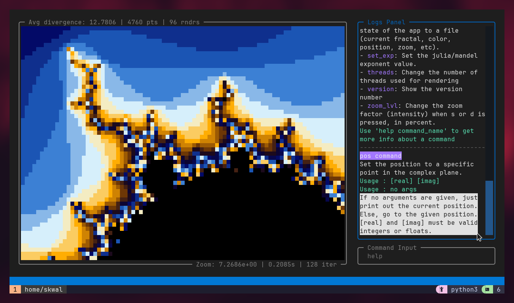
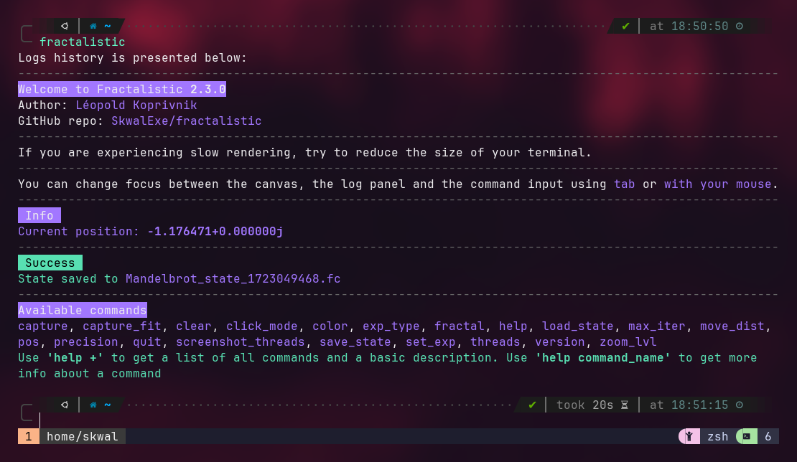

# The Logs Panel 📜

To go beyond the exploration of basic fractals, you'll need to use the command system. While the next section will delve into this topic in detail, let's first take a look at the logs panel.

The logs panel is a crucial part of the command system, as it is used to display all the generated information. Understanding its features and how to interact with it is essential.

### Scrolling through the logs

There are several ways of scrolling through the output in the logs panel. 
- Using your **mouse wheel** on the component
- using the **`up` and `down` arrow keys**
- using advanced control keys like **`Home`, `End`, `PageUp` and `PageDown` .**

This is pretty straightforward, but now comes the tricky part.

### Copying output

At various occasions, you may want to copy output from the logs panel, for example, if you want to share coordinates, printed using the `pos` command.
However, because of how the application's interface works, **you will not be able to simply select some text and copy it** like you would in typical terminal programs.

The terminal content is continuously being refreshed to update parts of the screen, making text selection a little complicated. But nothing that we can't fix! You still have 2 possibilities for copying text.

- The first way is to freeze the terminal content by using **the text selection feature.** Most terminal emulators provide this function, where holding `Shift` or `Alt` while selecting text will **freeze the content or ignore updates.** This allows you to copy the desired portion. You may also want to use this in combination with the **block selection** feature, where also pressing `Ctrl` at the same time will allow you to select **a block instead of lines of text.**

    

- Another way to copy text is to do it when quitting the app. If Fractalistic is terminated correctly, either by pressing `Ctrl+C` or by using the `quit` command, the logs history will be printed to the terminal upon exit, allowing you to copy text like you normally would.

    

### Related commands

Commands related to the logs panel are:

- `clear`: This command can be used to clear the logs panel. Erased output will not be displayed when quitting the application.
